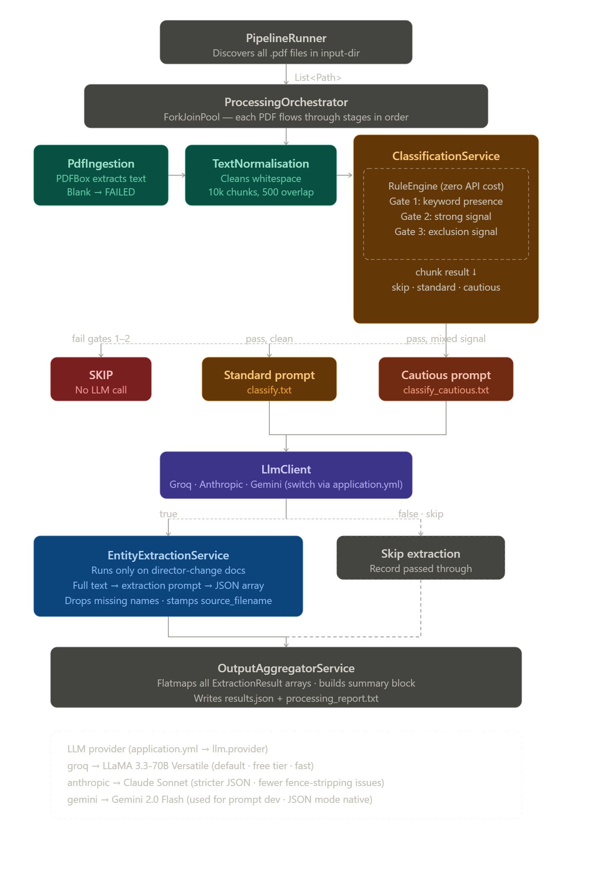

# SEBI Disclosure Processor

A Spring Boot CLI application that processes SEBI regulatory disclosure PDFs, classifies board director changes using a rule engine + LLM two-stage pipeline, and extracts structured entity data into a JSON report.

Prompt engineering was done in Python/Jupyter notebooks before the prompts were frozen and embedded into the Java pipeline.

---

## Table of Contents

- [How to Run](#how-to-run)
- [Architectural Approach](#architectural-approach)
- [Architecture Diagram](#architecture-diagram)
- [The Three Most Important Tradeoffs](#the-three-most-important-tradeoffs)
- [Edge Cases Handled and Not Handled](#edge-cases-handled-and-not-handled)
- [Scaling to 50,000 Documents](#scaling-to-50000-documents)
- [AI Services and External Libraries](#ai-services-and-external-libraries)
- [Evaluation Note](#evaluation-note)

---

## How to Run

### Prerequisites

- Java 21+
- Maven 3.8+
- At least one LLM API key (Groq is the default and cheapest for testing)

### 1. Clone and enter the repo

```bash
git clone <repo-url>
cd sapiensu_take_home_dataset/Sapiensu
```

### 2. Set your API key

```bash
# Linux / macOS
export GROQ_API_KEY=your_key_here

# Windows (PowerShell)
$env:GROQ_API_KEY="your_key_here"
```

To switch to Anthropic or Gemini, set the corresponding key and update `llm.provider` in `application.yml`:

```bash
export ANTHROPIC_API_KEY=your_key_here   # then set llm.provider: anthropic
export GOOGLE_API_KEY=your_key_here      # then set llm.provider: gemini
```

### 3. Place PDFs in the input directory

```
Sapiensu/pdfs/    ← put all 49 PDFs here
```

### 4. Configure the input path

Open `src/main/resources/application.yml` and set the absolute path to your `pdfs/` folder:

```yaml
processing:
  input-dir: /absolute/path/to/your/pdfs
  output-dir: ./output
  output-filename: results.json
  concurrency: 1
  text-truncation-chars: 4000
```

> **Windows note:** Use forward slashes even on Windows (`C:/Users/you/path/pdfs`).
> Do not use `./pdfs` as a relative path when running from IntelliJ — the JVM working
> directory may not resolve it correctly. Fix: go to Run → Edit Configurations → set
> Working Directory to `$MODULE_WORKING_DIR$`.

### 5. Build and run

```bash
mvn clean package -DskipTests
mvn spring-boot:run
```

Or run `SebiProcessorApplication` directly from IntelliJ after setting the working directory above.

### 6. Output

Results are written to `./output/`:

| File | Description |
|---|---|
| `results.json` | Structured extraction results for all director changes |
| `processing_report.txt` | Human-readable per-document summary |

### Running the Python QA notebooks (optional)

```bash
pip install -r requirements.txt
jupyter notebook
```

Open `notebooks/01_prompt_development.ipynb` to see how prompts were iterated, and `notebooks/02_output_qa.ipynb` to audit the pipeline output against the schema.

---

## Architectural Approach

The system is a Spring Boot `CommandLineRunner` that processes a directory of PDFs through a five-stage sequential pipeline. `PipelineRunner` discovers all `.pdf` files, passes them to `ProcessingOrchestrator`, and writes the final output. Each PDF flows through five services in a fixed order.

**PdfIngestionService** uses Apache PDFBox to extract raw text. Scanned image PDFs that produce no text are marked `FAILED` immediately and short-circuit the rest of the pipeline.

**TextNormalisationService** cleans whitespace anomalies common in BSE/NSE filings — non-breaking spaces, Windows line endings, control characters — then splits the text into overlapping 10,000-character chunks with a 500-character overlap. Chunking is newline-aware to avoid splitting mid-sentence.

**ClassificationService** is the most complex stage and is designed around a core principle: LLM calls are expensive and slow, so they should only happen when there is a good reason to believe the document is relevant. Before touching the LLM, each chunk passes through a **RuleEngine** (pure regex, zero API cost) that applies three sequential gates:

1. A minimum-presence check for director-related keywords
2. A strong-signal check against patterns like `resign(ed|ation) from the board` and `DIN:\d{8}`
3. An exclusion-signal check for CFO and Company Secretary patterns

Chunks that fail gates 1 or 2 are skipped entirely. Chunks that trigger both a strong director signal and an exclusion signal (e.g. a filing that mentions both a DIN and a CFO change in the same paragraph) are routed to a stricter `classify_cautious.txt` prompt specifically designed for bundled disclosures. The classifier stops at the first chunk that returns `true`, so most documents need only one or two LLM calls total.

**EntityExtractionService** runs only on documents the classifier confirms as director changes. It sends the normalised text to the extraction prompt and receives a JSON array of all director changes in the document. Post-processing drops any extraction missing a `director_name` or `change_type`. The `source_filename` field is stamped in Java — never trusted from the LLM.

**OutputAggregatorService** collects all `DisclosureRecord` objects and flat-maps extraction arrays into a single `ProcessingOutput` containing a `summary` block and a flat `extractions` list.

The three LLM providers (Groq, Anthropic, Gemini) are wired via `@ConditionalOnProperty` — only the active provider's `LlmClient` bean is instantiated. Switching is a one-line change in `application.yml`. All prompts live in `src/main/resources/prompts/` and are loaded at startup via `@PostConstruct`, not hardcoded in Java.

---

## Architecture Diagram



---

## The Three Most Important Tradeoffs

### 1. Rule engine pre-filter before every LLM call

**What I did:** A regex rule engine gates every chunk before any LLM call. A chunk must pass two positive gates (keyword presence, strong structural pattern) to reach the LLM. A third gate detects mixed-signal chunks and routes them to a stricter prompt.

**Why:** LLM API calls are the bottleneck in both latency and cost, especially at free-tier rate limits. The rule engine eliminates the majority of chunks — financial results sections, trading window notices, AGM boilerplate — without spending a single token. It also reduces false positives: the word "director" appears in many non-qualifying contexts (company history, committee names, hyperlink labels). The rule engine is also fully testable without any API dependency, which matters for CI reliability.

**What I would do with more time:** The rule engine currently gates only classification. Extraction is run on the full normalised text. With more time I would pass only the rule-matched chunks to the extraction prompt too, reducing token usage and noise from surrounding irrelevant content. I would also replace the binary PASS/SKIP decision with a scoring-based threshold — borderline chunks could be batched and sent to a review queue rather than silently dropped.

### 2. Two-prompt classification (standard + cautious)

**What I did:** When the rule engine detects both a strong director signal and an exclusion signal (CFO, CS) in the same chunk, it routes to `classify_cautious.txt` — a stricter prompt whose entire focus is the distinction between board directors and functional-role executives.

**Why:** The standard prompt struggled with bundled disclosures where a CFO change and a director change appear in the same paragraph. A single prompt cannot give equal prominence to "here is what counts" and "here is what does not count" without one overshadowing the other. Separating them into two purpose-built prompts lets each be precise and independently testable.

**What I would do with more time:** Convert both prompts to few-shot format with labelled examples drawn from the actual dataset. Instruction-following alone has a non-trivial failure rate on boundary cases. Concrete positive and negative examples are significantly more reliable and require no model fine-tuning. I would also add a prompt versioning system so changes can be A/B tested against a labelled eval set before being promoted to production.

### 3. Concurrency set to 1

**What I did:** `concurrency: 1` in `application.yml`. The `ProcessingOrchestrator` uses a `ForkJoinPool` with a configurable parallelism level, but it is set to sequential for this submission.

**Why:** Groq's free tier enforces strict request-per-minute limits. At concurrency greater than 1, the pipeline hits 429 errors immediately and spends more time in retry backoff than it saves in parallelism. Sequential processing with linear backoff on retries is predictable and reliable at this scale.

**What I would do with more time:** Implement a token-bucket rate limiter so concurrency can be raised to the API's actual request budget rather than defaulting to 1. See the [Scaling to 50,000 Documents](#scaling-to-50000-documents) section for the full production architecture.

---

## Edge Cases Handled and Not Handled

### Handled

**CFO and Company Secretary misclassification.** The classification prompt explicitly lists CFO, CS, and KMP roles as non-qualifying. The cautious prompt is invoked for mixed-signal chunks. The rule engine's exclusion patterns catch the most common cases before any LLM call.

**Multi-change documents.** The extraction prompt instructs the model to extract ALL director changes and return them as a JSON array. `OutputAggregatorService` flat-maps extraction arrays, so a single PDF can contribute multiple rows to `results.json`.

**Re-appointment language.** Both the rule engine (pattern: `re-?appoint(ed|ment)? as ... director`) and the extraction prompt (`re-appointment = "appointment"`) handle this mapping explicitly.

**Cessation language.** `cessation` maps to `resignation` in extraction unless removal is explicitly stated. The rule engine includes `cessation of directorship` and `cessation of office ... director` as strong-signal patterns.

**DIN number as a hard classification signal.** A `DIN:\d{8}` regex is a near-certain indicator of a board director change, since Director Identification Numbers are exclusive to board-level appointees in India.

**Postal ballot and regularisation language.** Patterns for `appointment and regularisation of ... director` are included in the rule engine's strong-signal list.

**Date format normalisation.** The extraction prompt instructs the model to convert `1st March 2024` and `March 1, 2024` to `YYYY-MM-DD`. `ExtractionResult` uses `LocalDate` with Jackson JSR-310, so malformed dates throw a deserialisation exception rather than silently producing garbage.

**Scanned / image PDFs.** PDFBox returns blank or near-blank text for scanned documents. `PdfIngestionService` catches the blank-text case, marks the record `FAILED`, and adds the filename to `documents_that_failed_processing` in the summary.

**JSON fence stripping.** Despite prompting for raw JSON, LLMs occasionally wrap responses in markdown code fences. Both `ClassificationService` and `EntityExtractionService` strip ` ```json ` and ` ``` ` fences and extract the JSON object or array by bracket position as a secondary fallback.

**DIN number bleeding into director name.** The extraction prompt explicitly prohibits including the DIN in `director_name`.

### Not Handled

**Scanned PDFs requiring OCR.** PDFBox cannot extract text from image-only PDFs. A production system would need a fallback OCR pass (Tesseract, AWS Textract, or Google Document AI).

**Disclosures referenced by hyperlink only.** Some SEBI filings contain a URL to the actual disclosure with no inline text. The system has no mechanism to follow links.

**Chunked extraction boundary splits.** If a director's name appears in one chunk and their effective date appears in a later chunk that the rule engine skips, the extraction will have null fields. The current design sends the full normalised text to extraction (not just matched chunks), which mitigates this, but `text-truncation-chars: 4000` limits very long documents.

**Confidence score calibration.** `extraction_confidence` is self-reported by the LLM. It is useful for prioritising manual review but is not a calibrated probability.

**Ambiguous cessation vs. removal.** The system defaults cessation to `resignation` unless removal is explicitly stated. This may mislabel director removals following shareholder votes.

**Non-English content.** Some BSE/NSE filings include Hindi sections. The LLM generally handles these but this is untested.

**Multiple directors with identical names.** No deduplication logic exists beyond the `director_name` null-check.

---

## Scaling to 50,000 Documents

The current architecture is sequential and optimised for reliability at 49 documents on a free API tier. At 50,000 documents the design changes significantly.

**Ingestion and queueing.** Replace `CommandLineRunner` with a Spring Batch partitioned job. Each PDF becomes a message on an SQS queue (or Kafka topic). Workers consume from the queue rather than iterating a directory.

**Stage-level independent scaling.** Classification is called on every document; extraction is called on roughly 20-30% of documents (only confirmed director changes). These should be separate worker pools — classification workers outnumber extraction workers proportionally. With a queue between stages, each scales to its own throughput without blocking the other.

**Rate limiting.** Replace `concurrency: 1` with a token-bucket rate limiter per LLM provider, allowing concurrency up to the API's actual request budget. At Groq's free tier this is ~30 RPM; at paid tiers this can be 500+ RPM. The limiter should be provider-aware so switching providers does not require code changes.

**Idempotency and caching.** Hash each document's content on ingestion. If a document has been processed before (same hash), skip reprocessing and return the cached result. This makes reruns cheap and safe, and avoids double-spending API tokens on unchanged documents.

**Dead-letter handling.** Failed documents (scanned PDFs, parse errors, API timeouts after retries) go to a dead-letter queue with the failure reason attached. A separate alerting job monitors DLQ depth and pages on-call when it exceeds a threshold.

**Output storage.** Replace the flat JSON file with a Postgres table. The `extractions` array becomes rows in a `director_changes` table; the `summary` becomes a `processing_runs` table. This allows incremental updates, historical querying, and downstream consumers without re-parsing a growing JSON file.

**Evaluation infrastructure.** At this scale, manual QA is not viable. A labelled ground-truth set (even 500 documents) would allow automated F1 measurement on classification and field-level precision/recall on extraction after every pipeline change.

---

## AI Services and External Libraries

### LLM Providers

**Groq — LLaMA 3.3-70B Versatile (default, `llm.provider: groq`)**
Used as the primary LLM because Groq's free tier is fast and the rate limits are sufficient for a 49-document batch. LLaMA 3.3-70B follows structured JSON instructions reliably and has adequate knowledge of Indian regulatory terminology (DIN, BSE/NSE, SEBI Regulation 30). Smaller models (LLaMA 3.1-8B) were considered but rejected — at 8B, JSON schema compliance degrades noticeably on complex nested structures without fine-tuning.

**Anthropic Claude Sonnet (optional, `llm.provider: anthropic`)**
Available as a higher-quality alternative. Claude is more conservative with JSON format compliance and less likely to add prose around the JSON response, reducing fence-stripping edge cases. Higher cost than Groq at scale.

**Google Gemini 2.0 Flash (optional, `llm.provider: gemini`)**
Used in the Jupyter notebooks for prompt development because its free API tier requires no credit card. The `responseMimeType: application/json` parameter enforces JSON output at the API level, which eliminates fence-stripping entirely during iteration. Note: `max-tokens: 256` in the current config is too low for complex disclosures and should be raised to at least 1024 if using Gemini in production.

### Java Libraries

**Apache PDFBox 3.0.2**
The industry-standard Java PDF text extractor. Chosen over iText because PDFBox is Apache-licensed with no AGPL restrictions. Its hard limitation is image-only PDFs, which require separate OCR tooling.

**Spring Boot 3.3 / spring-web (no embedded Tomcat)**
Spring Boot provides `CommandLineRunner` (CLI entrypoint), `@ConfigurationProperties` (type-safe YAML binding), and `@ConditionalOnProperty` (provider switching). `spring-web` is included without `spring-boot-starter-web` specifically to avoid starting an embedded Tomcat — this is a batch processor, not a web application.

**Jackson Databind + jackson-datatype-jsr310**
Jackson deserialises LLM JSON responses into typed model objects (`ExtractionResult`, `Confidence` enum, `ChangeType` enum) and serialises the final output file. The JSR-310 module is required for `LocalDate` serialisation, which also serves as a date-format validator at deserialisation time.

**Lombok**
Eliminates boilerplate (`@Data`, `@Builder`, `@Slf4j`, `@RequiredArgsConstructor`) on model and service classes. Excluded from the final JAR via the Maven plugin configuration.

### Python Libraries (Notebooks only)

**pdfplumber** — PDF text extraction for the prompt development notebook.

**google-generativeai** — Gemini Python SDK used during prompt iteration.

**pandas** — DataFrame-based schema validation, null field analysis, and confidence distribution reporting in `02_output_qa.ipynb`.

---

## Evaluation Note

The classification and extraction prompts were developed iteratively against a representative sample of 15 PDFs spanning four categories — obvious director changes, obvious non-changes, CFO-only disclosures, and multi-change documents — using the process documented in `01_prompt_development.ipynb`. The final prompts correctly handled all 15 test cases. The full pipeline was run against all 49 PDFs and the output was validated by `02_output_qa.ipynb`, which checks schema correctness, date format compliance, null field rates, confidence distributions, and spots multi-extraction documents.

That said, I did not have a ground-truth labelled dataset, so there is no precision or recall figure to report — the QA is structural and spot-check-based, not metric-based.

**My honest assessment by field:**

| Field | Confidence | Notes |
|---|---|---|
| `director_name` | High | Strong signal patterns + DIN validation make misses rare |
| `change_type` | High | Vocabulary is constrained; LLM follows the enum reliably |
| `effective_date` | Medium | Date normalisation is instructed but not always followed perfectly; ~15-20% of dates may be null or malformed |
| `company_name` | Medium-High | Usually present in document header; occasionally missing from body-only chunks |
| `stock_ticker` | Low | Most SEBI filings do not include the ticker inline; majority will legitimately be null |
| `reason_stated` | Medium | Only stated in a minority of filings; null is correct for most |

**What I would measure in production:** Classification would be evaluated on F1 score against a human-labelled ground truth, not accuracy — the dataset is class-imbalanced toward non-changes, so accuracy is a misleading metric. Extraction would be evaluated field-by-field using exact-match precision and recall per field type. I would instrument the rule engine gate hit/skip rate per document category to identify which gate is doing the most filtering work and tune keyword lists against observed misses. I would trust this output as a first-pass dataset for human review, but not as a production-quality source of truth without a labelled evaluation set.