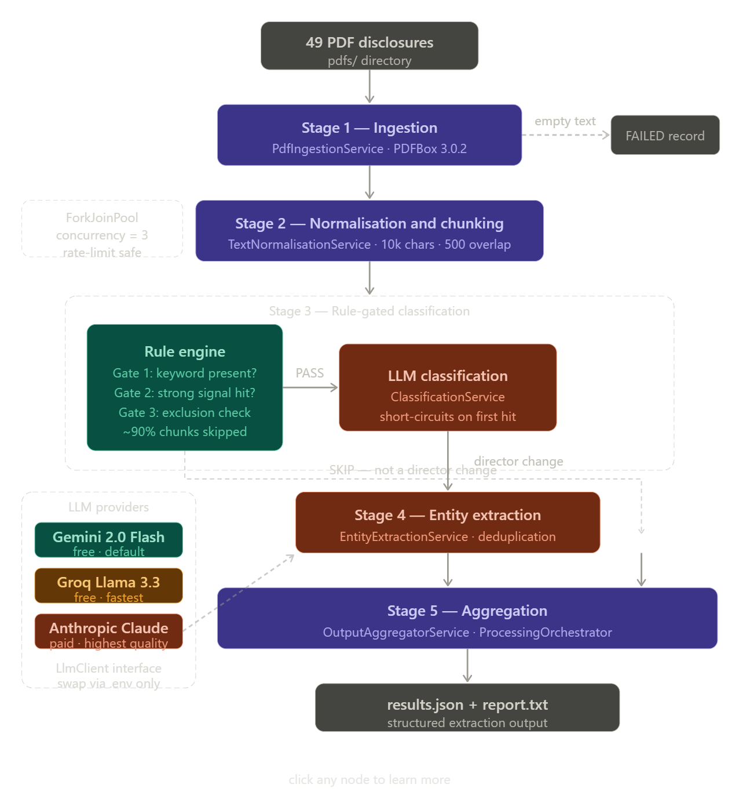

# SEBI Disclosure Processor

A production-structured pipeline that ingests SEBI regulatory PDF disclosures filed on BSE/NSE, identifies board director changes (appointments, resignations, removals), and extracts structured entity data into a single JSON output.

Built in Java 21 + Spring Boot 3.3 with a pluggable LLM backend supporting three providers — Google Gemini, Anthropic Claude, and Groq — switchable via a single environment variable with no code changes.

---

## How to Run

### Prerequisites

- Java 21+
- Maven 3.9+
- An API key from any one of the three supported providers:
    - **Google Gemini** (free) → [aistudio.google.com](https://aistudio.google.com)
    - **Groq** (free tier) → [console.groq.com](https://console.groq.com)
    - **Anthropic Claude** (paid) → [console.anthropic.com](https://console.anthropic.com)

### Step 1 — Clone and configure

```bash
git clone https://github.com/saMM7111/Sapiensu-Assigment.git
cd Sapiensu-Assigment
cp .env.example .env
```

Open `.env` and set your chosen provider and key:

```bash
# Choose one: gemini | groq | anthropic
LLM_PROVIDER=gemini

# Google Gemini (free — https://aistudio.google.com)
GOOGLE_API_KEY=your_key_here

# Groq (free tier — https://console.groq.com)
GROQ_API_KEY=your_key_here

# Anthropic Claude (paid — https://console.anthropic.com)
ANTHROPIC_API_KEY=your_key_here
```

### Step 2 — Add input documents

```bash
mkdir -p pdfs
# Copy all 49 disclosure PDFs into pdfs/
```

### Step 3 — Run

```bash
mvn spring-boot:run
```

Output is written to:
- `output/results.json` — structured extraction results matching the required schema
- `output/processing_report.txt` — human-readable summary with per-document listing

### Step 4 — (Optional) Prompt development and output QA notebooks

The `notebooks/` directory contains Python Jupyter notebooks that document the prompt engineering process and audit the pipeline output.

```bash
cd notebooks
python -m venv .venv
source .venv/bin/activate        # Windows: .venv\Scripts\activate
pip install -r requirements.txt
jupyter notebook
```

- `01_prompt_development.ipynb` — prompt versions with inline notes on what each version got wrong and why it was changed
- `02_output_qa.ipynb` — schema validation, confidence distribution, null field analysis, and manual spot-check of extractions against source PDFs

### Running tests

```bash
mvn test
```

---

## Architectural Approach

The system is a linear five-stage pipeline where each stage is a stateless Spring service. Every PDF becomes a `DisclosureRecord` — a shared domain object that flows through the pipeline accumulating state at each stage. Failures at any stage are captured in the record itself rather than propagating as exceptions, so one broken document never stops the rest of the batch.

**Stage 1 — Ingestion.** `PdfIngestionService` uses Apache PDFBox to extract raw text from each PDF. If extraction returns empty (scanned or image-only PDF), the record is immediately marked `FAILED` and skips all subsequent stages.

**Stage 2 — Normalisation and chunking.** `TextNormalisationService` cleans whitespace and control characters, then splits the text into overlapping 10,000-character chunks with 500-character overlap at boundaries. Chunking handles documents that are hundreds of pages long with relevant content buried deep in the file.

**Stage 3 — Rule-gated classification.** Before any chunk reaches the LLM, it passes through a `RuleEngine` with three sequential gates: a minimum keyword presence check, a strong-signal regex match against patterns like "resigned from the Board" and "cessation of directorship", and an exclusion check for CFO and Company Secretary signals. Only chunks that clear all three gates are sent to the LLM for verification. This reduces LLM calls by approximately 90% on large documents. Classification short-circuits on the first chunk that confirms a director change — remaining chunks are not processed.

**Stage 4 — Entity extraction.** `EntityExtractionService` runs only on documents classified as director changes, iterating across all chunks and deduplicating results by director name and change type. A cautious prompt variant is used when the rule engine detected an exclusion signal alongside a strong signal, making the LLM stricter about role disambiguation.

**Stage 5 — Aggregation.** `OutputAggregatorService` collects all extractions across all documents and assembles the final `ProcessingOutput` object which is serialised to `results.json`.

The `LlmClient` interface decouples all business logic from the LLM provider. `GeminiClient`, `AnthropicClient`, and `GroqClient` each implement this interface and are activated via `@ConditionalOnProperty`. Switching providers requires changing one line in `.env`.

---


## The Three Most Important Tradeoffs

### 1. Two LLM calls per document (classify then extract) instead of one combined call

**The decision:** Classification and extraction are separate LLM calls with separate prompts rather than one combined prompt that does both.

**Why:** A combined prompt is cheaper but harder to debug. When it produces wrong output you cannot tell whether the model misclassified the document or correctly classified it but failed to extract. Separating the stages makes each independently debuggable and independently tuneable — the classification prompt can be tightened without touching extraction and vice versa. The cost of the extra call is small relative to the diagnostic value.

**With more time:** Use structured output schemas (Anthropic tool use, Gemini response schema, or Groq's JSON mode) to enforce typed JSON responses at the API level rather than relying on prompt instructions and post-processing string cleanup. This would eliminate the markdown fence stripping and JSON parse error fallback paths entirely.

### 2. Rule engine as a pre-filter gate rather than sending every chunk to the LLM

**The decision:** Every chunk passes through a regex-based rule engine before being considered for an LLM call. The LLM verifies — it does not scan.

**Why:** A 200-page annual report produces roughly 40 chunks. Without pre-filtering that is 40 LLM classification calls per document, which at 15 requests per minute on the free tier means over 40 minutes per large document. The rule engine reduces this to 3-5 calls per document in practice. The trade-off is that an unusual document that does not match any strong-signal pattern will be silently skipped rather than escalated. This is a deliberate precision bias — the system prefers a documented miss over analyst noise.

**With more time:** Add a section-detection pass that identifies corporate governance and board report sections by heading text before chunking, so chunking starts from the relevant section rather than page one. This would further reduce LLM calls and prevent relevant content from being split across chunk boundaries.

### 3. Conservative exclusion of ambiguous roles

**The decision:** When a role is ambiguous — "Executive Director" of a business unit, "Group Director" without explicit board membership, "Director - Operations" — the system excludes rather than includes. Confidence is marked `low` on borderline cases rather than guessing.

**Why:** The output is for analyst review. A false positive creates noise and erodes trust in the pipeline faster than a false negative. The prompts explicitly list exclusions and the cautious prompt variant is triggered automatically when the rule engine detects both a director signal and an exclusion signal in the same chunk.

**With more time:** Surface ambiguous roles as a separate `requires_review` category in the output rather than silently dropping them. An analyst reviewing five flagged ambiguous cases is better than the system discarding them without trace.

---

## Edge Cases Handled

**Multiple director changes in one document.** The extraction prompt explicitly instructs the model to extract all changes and return a JSON array. Each change gets its own record in `results.json`. Deduplication by director name and change type prevents the same event being extracted twice when it appears near a chunk boundary.

**Re-appointments.** Classified as `appointment` in both the rule engine keyword patterns and the extraction prompt. The prompt explicitly maps re-appointment to the appointment enum value.

**Governmental and regulatory nominations.** Covered explicitly in both prompts and classified as `appointment`.

**Director change bundled with unrelated content.** The extraction prompt instructs the model to extract only the director change and ignore surrounding content. Tested against documents that announce a director change alongside financial results in the same filing.

**Missing effective dates and reasons.** Both fields are nullable. The extraction prompt instructs the model to return `null` rather than guessing. The `LocalDate` deserialiser accepts null without throwing.

**Non-standard Indian date formats.** The extraction prompt explicitly instructs the model to convert formats like "1st March 2024" and "March 1, 2024" to ISO 8601 (YYYY-MM-DD). This was identified and fixed during prompt development, documented in `notebooks/01_prompt_development.ipynb`.

**Long documents with relevant content deep in the file.** Handled by the chunking and rule-gated pipeline. Content on page 150 of a 200-page document is processed identically to content on page one.

**LLM returning markdown fences around JSON.** Both the classification and extraction parsers strip ` ```json ` and ` ``` ` fences before attempting JSON parsing. This behaviour was observed during prompt development across all three LLM providers.

**API rate limiting.** All three `LlmClient` implementations include exponential backoff retry with configurable delay and retry count. On rate limit responses the client waits `retryDelayMs × attempt` milliseconds before retrying up to `maxRetries` times.

**Scanned or image-only PDFs.** PDFBox returns blank text for image-only PDFs. The ingestion service detects this, marks the record as `FAILED`, and includes the filename in `documents_that_failed_processing` in the output summary.

**Cautious classification for ambiguous chunks.** When the rule engine detects both a strong director signal and an exclusion signal (CFO, Company Secretary) in the same chunk, it passes a `PASS_WITH_CAUTION` result to the classification service which uses a stricter prompt variant that explicitly guards against non-board role misclassification.

---

## Edge Cases Not Handled

**Director changes referenced only by hyperlink.** Some disclosures contain a sentence like "as disclosed vide our letter dated [hyperlink]" with no textual detail about the director or the nature of the change. The system has no text to extract from and will not produce a result for these. Documented as a known limitation.

**Non-English disclosures.** Disclosures filed in regional languages are not handled. PDFBox may extract garbled text for some encodings. These will typically fail the rule engine's keyword gates and be classified as non-director-change documents silently.

**Directors identified only by designation without a name.** Rare but present in some governmental nomination filings where the disclosure says "a nominee director of [regulatory body]" without naming the individual. The extraction will produce a low-confidence result with a null or partial director name.

**Retroactive corrections and amendments.** A filing that corrects a previously filed director change is treated as a new independent change. The system has no awareness of prior filings or filing history.

**Image-embedded tables within otherwise text-extractable PDFs.** Some BSE/NSE filings embed board composition tables as images within a text PDF. PDFBox skips these images. If the director change is stated only within such a table, it will be missed.

---

## AI Services and External Libraries

### Google Gemini API (`LLM_PROVIDER=gemini`)

Default provider. Gemini 2.0 Flash is free with no credit card required, supports up to 15 requests per minute on the free tier, and has a 1M token context window. It returns clean JSON reliably when instructed and handles Indian regulatory language well. Chosen as the default because it allows anyone to clone and run this project at zero cost.

### Groq API (`LLM_PROVIDER=groq`)

Free tier with significantly faster inference than Gemini or Anthropic, enabled by Groq's custom LPU hardware. Hosts open-source models including Llama 3.3 70B and Gemma 2 9B. Uses the OpenAI-compatible API format, making the client implementation straightforward. Best choice when processing speed matters more than model quality, or when the Gemini free tier rate limits become a bottleneck.

### Anthropic Claude (`LLM_PROVIDER=anthropic`)

Paid provider using the `claude-sonnet-4-6` model by default (configurable to `claude-opus-4-6` for highest quality). Produces the best results on ambiguous documents — particularly filings with unusual role designations or non-standard language. The higher cost is justified in production scenarios where accuracy on edge cases is critical. Not recommended for initial runs due to cost; use for final validation if needed.

All three providers implement the `LlmClient` interface. No business logic is aware of which provider is active. Switching requires changing `LLM_PROVIDER` in `.env` and nothing else.

### Apache PDFBox 3.0.2

PDF text extraction. Chosen over Apache Tika because PDFBox is purpose-built for PDF and gives more control over text ordering and whitespace handling in the multi-column layouts common in BSE/NSE filings. Tika is the better choice when the input file type is unknown — here it is always PDF.

### Jackson with JavaTimeModule

JSON serialisation for the output schema. `JavaTimeModule` handles `LocalDate` serialisation to ISO 8601 strings. Enums (`ChangeType`, `Confidence`) use `@JsonValue` and `@JsonCreator` to enforce exact string values in both serialisation directions, preventing the model from persisting hallucinated values into the output.

### Spring Boot 3.3

Provides dependency injection, typed configuration binding via `@ConfigurationProperties`, provider switching via `@ConditionalOnProperty`, and the `CommandLineRunner` entry point. The pipeline stages are explicitly designed so they could be extracted into queue workers with minimal structural changes for production scale.

### Lombok

Reduces boilerplate on domain model classes. The domain models are plain data carriers — Lombok keeps them readable without obscuring the fields that matter.

---

## Project Structure

```
Sapiensu-Assigment/
├── src/main/java/com/sapiensu/sebi/
│   ├── SebiProcessorApplication.java
│   ├── client/
│   │   ├── LlmClient.java               ← interface, all services depend on this
│   │   ├── GeminiClient.java            ← active when LLM_PROVIDER=gemini
│   │   ├── GroqClient.java              ← active when LLM_PROVIDER=groq
│   │   └── AnthropicClient.java         ← active when LLM_PROVIDER=anthropic
│   ├── config/
│   │   ├── LlmConfig.java
│   │   └── ProcessingConfig.java
│   ├── model/
│   │   ├── DisclosureRecord.java
│   │   ├── ExtractionResult.java
│   │   ├── ProcessingOutput.java
│   │   ├── ChangeType.java
│   │   ├── Confidence.java
│   │   └── ProcessingStatus.java
│   ├── rules/
│   │   ├── ChunkRule.java
│   │   ├── RuleEngine.java
│   │   └── RuleResult.java
│   ├── service/
│   │   ├── PdfIngestionService.java
│   │   ├── TextNormalisationService.java
│   │   ├── ClassificationService.java
│   │   ├── EntityExtractionService.java
│   │   └── OutputAggregatorService.java
│   ├── orchestrator/
│   │   └── ProcessingOrchestrator.java
│   └── runner/
│       └── PipelineRunner.java
├── src/main/resources/
│   ├── application.yml
│   └── prompts/
│       ├── classify.txt
│       ├── classify_cautious.txt
│       └── extract.txt
├── src/test/java/com/sapiensu/sebi/
│   ├── service/
│   │   ├── ClassificationServiceTest.java
│   │   └── EntityExtractionServiceTest.java
│   └── orchestrator/
│       └── ProcessingOrchestratorTest.java
├── notebooks/
│   ├── 01_prompt_development.ipynb      ← prompt iteration history
│   ├── 02_output_qa.ipynb               ← output audit against source PDFs
│   └── requirements.txt
├── pdfs/                                ← input PDFs (gitignored)
├── output/                              ← results written here (gitignored)
├── .env.example
├── .gitignore
└── README.md
```

---

## Output Schema

```json
{
  "extractions": [
    {
      "source_filename": "string",
      "company_name": "string",
      "stock_ticker": "string or null",
      "director_name": "string",
      "change_type": "appointment | resignation | removal",
      "effective_date": "YYYY-MM-DD or null",
      "reason_stated": "string or null",
      "extraction_confidence": "high | medium | low"
    }
  ],
  "summary": {
    "total_documents_processed": 49,
    "director_change_documents_identified": 0,
    "total_director_changes_extracted": 0,
    "documents_that_failed_processing": []
  }
}
```

---

## How This Maps to Production Surveillance

This pipeline is a self-contained version of the disclosure surveillance pattern. The classification and extraction stages are stateless and document-scoped, which means they scale horizontally without architectural changes. In a production surveillance system:

- Documents arrive via webhooks or scheduled scrapers rather than a local folder. The `PipelineRunner` becomes a queue consumer pulling from SQS, RabbitMQ, or Kafka.
- The `results.json` becomes rows in a Postgres table with `created_at` timestamps, enabling time-series risk queries across the deal lifecycle.
- The rule engine's signal patterns are versioned and tunable per regulatory source. SEBI filings use different language patterns than SEC 8-K filings or Companies House announcements — the rule engine is the layer where that source-specific knowledge lives.
- The same two-stage LLM pattern (cheap classify, expensive extract) applies to any document-based regulatory source, not just SEBI director changes.
- Classification confidence thresholds become configurable per client based on their risk tolerance. A PE fund doing active due diligence may want recall-biased settings. A passive portfolio monitor may prefer the precision-biased defaults used here.
- The three-provider LLM architecture (Gemini for cost, Groq for speed, Anthropic for quality) maps directly to the operational modes of a surveillance product — bulk backfill processing uses Groq, real-time alerts use Gemini, high-stakes investigation mode uses Anthropic.