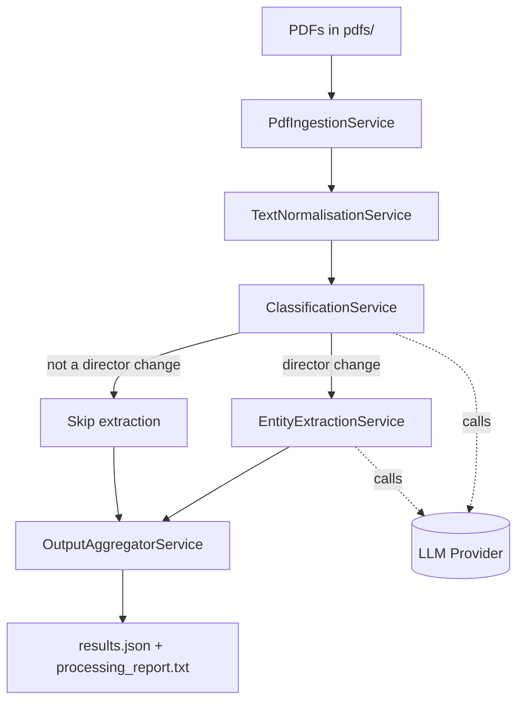

# SEBI Disclosure Processor

Process SEBI regulatory PDF disclosures, classify director changes, extract
structured entities, and write results to JSON and a human-readable report.

## Quick start
1) `cp .env.example .env`
2) Set `GOOGLE_API_KEY` (or `ANTHROPIC_API_KEY`) and `LLM_PROVIDER`
3) `mvn spring-boot:run`

Input PDFs must be in `pdfs/`. Output is written to `output/`.

## Configuration
The app reads `src/main/resources/application.yml` for:
- `processing.input-dir` (default: `./pdfs`)
- `processing.output-dir` (default: `./output`)
- `processing.output-filename` (default: `results.json`)
- `processing.concurrency` (default: `3`)

## Outputs
- `output/results.json`: structured extraction results
- `output/processing_report.txt`: summary + per-document extraction listing

## Architecture

## Notes
- Choose provider via `LLM_PROVIDER=gemini|anthropic` in `.env`.
- Scanned/image-only PDFs may fail text extraction and are reported as failed.
- The pipeline is precision-biased: uncertain roles are excluded by design.